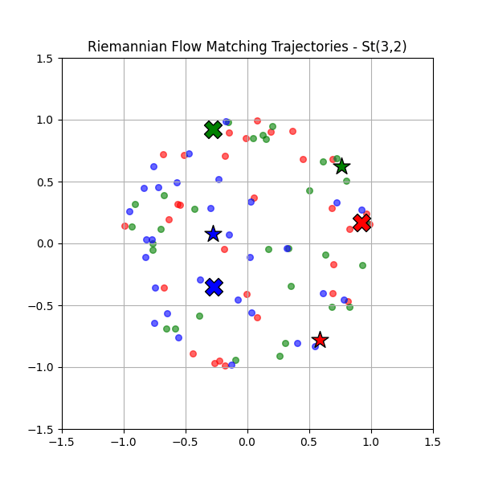

# Stiefel Flow Matching (Toy Example)

Vibe-coded using Gemini, please forgive any errors. Credits to [Ralf Zimmermann](https://github.com/RalfZimmermannSDU/RiemannStiefelLog/blob/dbf9b96a0a650c7277777e9f95f36eca9fa3342b/Stiefel_log_RZ_SIMAX_2017/SciPy/Stiefel_Exp_Log.py) for the Stiefel Exp/Log implementations.

This repository provides an accessible, fully self-contained PyTorch tutorial demonstrating Riemannian flow matching on the Stiefel Manifold $St(n, p)$.

The Stiefel manifold represents the space of all $n \times p$ matrices with orthonormal columns ($U^T U = I_p$).

## 🚀 The Tutorial

**Start Here: [`stiefel_fm_tutorial.ipynb`](stiefel_fm_tutorial.ipynb)** 

It steps sequentially through the geometric formulation (Riemannian Exp/Log), visual target plotting, neural tangent-space vector projection, and exact trajectory integration.

Gemini also showed that computing the velocity of the interpolant can be done analytically once you know the logarithm, so instead of computing the logarithm twice for each training step, we can compute it once and reuse it.

In this toy demo, we precompute a dataset of logarithms, rather than computing logarithms on the fly.

## 🌟 Visualization 

The goal of our toy model is to train a continuous vector field that transports a random uniform Stiefel distribution into a smooth target distribution.

The target distribution we explicitly model is a mixture of two Stiefel points with projected Gaussian noise added. The first Stiefel point is shown in stars, and the second is shown in crosses.

**Interpreting the Animation:**
Because matrices on $St(3, 2)$ inherently hold the shape $3 \times 2$, we can elegantly visualize any individual layout matrix physically as **three distinct points on a 2D plane**.  
- The **Dots** represent elements beginning mapped from total uniform noise actively flowing continuously across the manifold trajectory. 
- The **Stars** and **Crosses** denote the exact explicit center bounds of the two target mixture clusters. 
- As integration time $t \rightarrow 1$, we see the uniform distribution transform into the mixture distribution.
